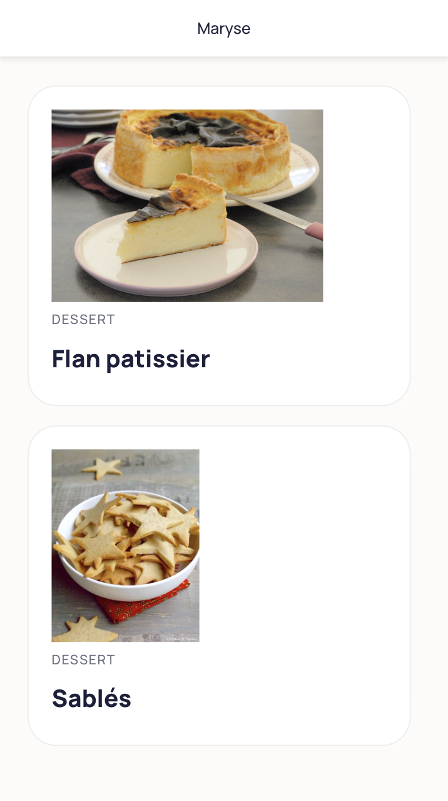
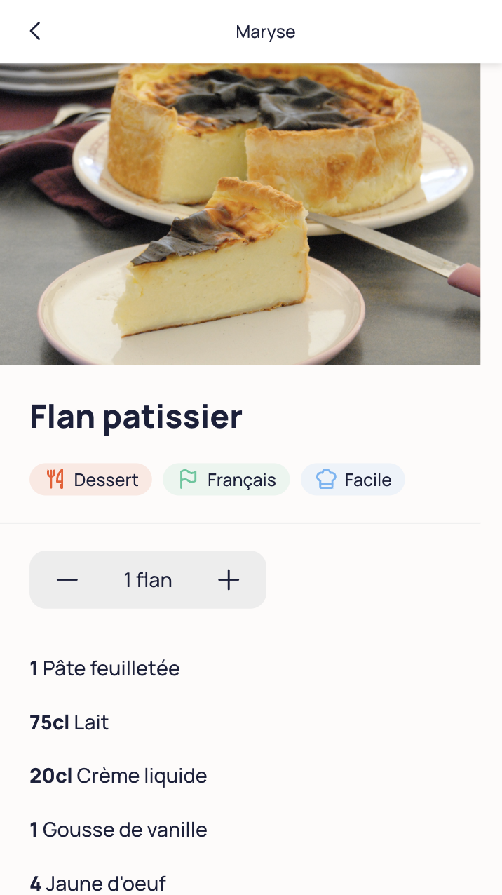
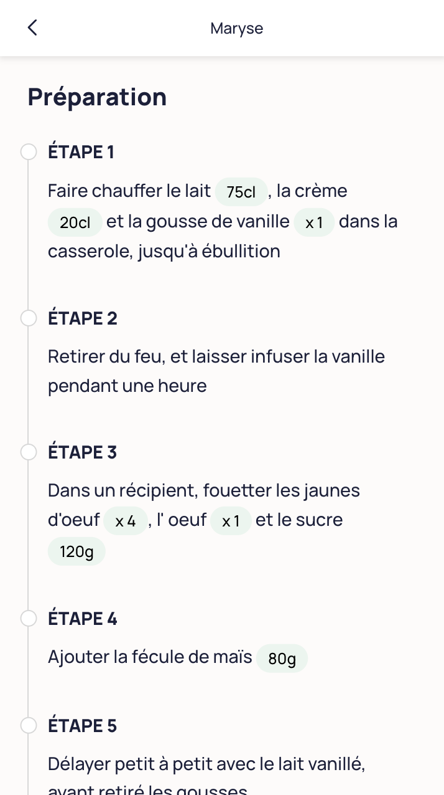

# Maryse Cookbook

Maryse is a open-source serverless cookbook to create and host recipes on your own GitHub repository.  
  
\>\> [Discover Maryse here](https://maryse.me) <<

## Example

Source repository: https://github.com/pierreavn/recipes  
  
Recipes List:  

  
Recipe Ingredients:  

  
Recipe Steps:  

## Color Palette
https://coolors.co/palette/dad7cd-a3b18a-588157-3a5a40-344e41

## Improvements Ideas
- Recipe
  - Display durations
  - Add tags
  - Conversions
- Ingredients
  - Pictures
  - Price
- Comments on recipes with PR
